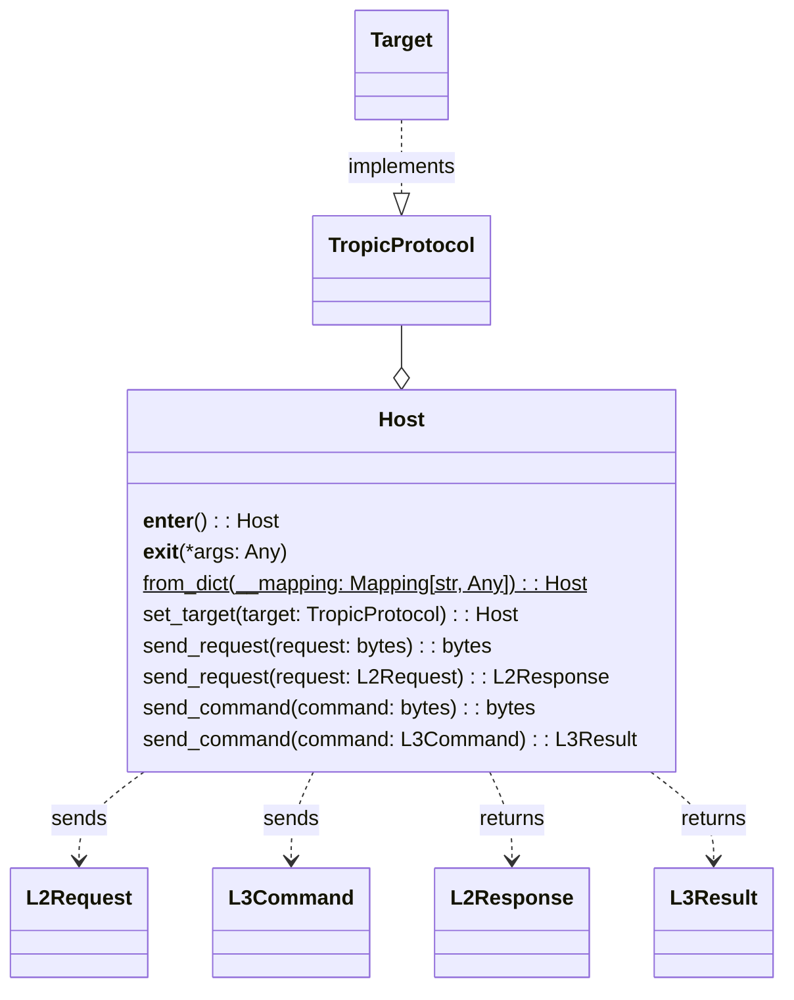

# Host

The `Host` class abstracts the communication with a TROPIC01 target: it
essentially holds the secure channel-related data and provides methods to
communicate with a target on the L2-level as well as on the L3-level.

> The target is expected to comply with the `TropicProtocol`
> (more info [here](../targets/README.md#tropicprotocol)).

The diagram below shows the main methods of the `Host` as well as how it works
with a target and the messages:



More on the messages [here](../messages/README.md).

## Instantiation with constructor method

The `Host` class can be instantiated by its constructor method:

```python
from tvl.host.host import Host

host = Host(
    s_h_priv=b"HOST_PRIVATE_KEY",
    s_h_pub=b"HOST_PUBLIC_KEY",
    s_t_pub=b"TROPIC_PUBLIC_KEY",
    pairing_key_index=3,
    target=<TropicProtocol-compliant target>,
)
```

## Instantiation with `Host.from_dict` class method

Alternatively, it can be instantiated by its `from_dict` class method.
The example below is equivalent to the one above:

```python
from tvl.host.host import Host

host = Host.from_dict(
    {
        "s_h_priv": b"HOST_PRIVATE_KEY",
        "s_h_pub": b"HOST_PUBLIC_KEY",
        "s_t_pub": b"TROPIC_PUBLIC_KEY",
        "pairing_key_index": 3,
    }
# The target can be set with the `set_target` method
).set_target(<TropicProtocol-compliant target>)
```

> The `from_dict` class method accepts only Python builtin types, such as `bytes`
> or `int`, therefore the target cannot be assigned to the `Host` with this class
> method and has to be assigned with the `set_target` method.

### Validating the configuration

The `configuration_file_model.py` file provides a
[pydantic](https://pypi.org/project/pydantic/1.10.13/)
model for validating the host configuration dictionary: `HostConfigurationModel`.

Example:
```python
from tvl.host.host import Host
from tvl.configuration_file_model import HostConfigurationModel

host_configuration = {
    "s_h_priv": b"HOST_PRIVATE_KEY",
    "s_h_pub": b"HOST_PUBLIC_KEY",
    "s_t_pub": b"TROPIC_PUBLIC_KEY",
    "pairing_key_index": 3,
}
# Check the configuration with the dedicated pydantic model
HostConfigurationModel.validate(host_configuration)
# An error is raised if the configuration is invalid
host = Host.from_dict(host_configuration)
```

> The `Tropic01Model` class can also be instantiated this way and also has a dedicated
> pydantic model to validate its configuration, `ModelConfigurationModel`.
> More info [here](../targets/model/README.md).

## L2-level communication

The `Host` communicates with a target on the L2-level with its method
`send_request`. For flexibility of use, this method has two overloads:

```python
@overload
def send_request(self, request: bytes) -> bytes:
    ...

@overload
def send_request(self, request: L2Request) -> L2Response:
    ...
```

The user can therefore transmit a request as `bytes` and receive the response
as `bytes` or send an `L2Request` object and receive the response
as an `L2Response` object.

The method `send_request` sends the request using the comunication protocol
defined in the
[TROPIC01 datasheet](https://tropic-gitlab.corp.sldev.cz/internal/tropic01/tassic/-/jobs/artifacts/master/file/public/tropic01_datasheet.pdf?job=pages)
and returns the response it receives from the target.

Example:
```python
from tvl.host.host import Host
from tvl.api.l2_api import TsL2GetInfoReqRequest, TsL2GetInfoReqResponse

# Instantiation of the Host
host = Host(target=<TropicProtocol-compliant target>)

# - First way: send bytes
response = host.send_request(b"\x01\x02\x02\x00+\x98")
# This assert statement is always true
assert isinstance(response, bytes)

# - Second way: send an L2Request object
# TsL2GetInfoReqRequest inherits from L2Request
response = host.send_request(TsL2GetInfoReqRequest(object_id=2, block_index=0))
# If the request is successfully processed, this assert statement is true
assert isinstance(response, TsL2GetInfoReqResponse)
```

More info on the low-level communication functions [here](../targets/README.md#examples-of-communication).

More info on `L2Request` and `L2Response` [here](../messages/README.md).

## L3-level communication

The `Host` communicates with a target on the L3-level with its method
`send_command`. For flexibility of use, this method has two overloads:

```python
@overload
def send_command(self, command: bytes) -> bytes:
    ...

@overload
def send_command(self, command: L3Command) -> L3Result:
    ...
```

The user can therefore transmit a command as `bytes` and receive the result
as `bytes` or send an `L3Command` object and receive the result
as an `L3Result` object.

The method `send_command` encrypts the command, chunk it into as many requests
(L2-level messages) as needed and send the requests.
It concatenates the responses it receives from the target into a single result,
then decrypts it and returns it.

Example:
```python
from tvl.host.host import Host
from tvl.api.l3_api import TsL3PingCommand, TsL3PingResult

# Instantiation of the Host and a target
host = Host(target=<TropicProtocol-compliant target>)

# - First way: send bytes
result = host.send_command(b"\x01deadbeef")
# This assert statement is always true
assert isinstance(result, bytes)

# - Second way: send an L3Command object
# TsL3PingCommand inherits from L3Command
result = host.send_command(TsL3PingCommand(data_in=b"deadbeef"))
# If the command is successfully processed, this assert statement is true
assert isinstance(result, TsL3PingResult)
```

More info on the low-level communication functions [here](../targets/README.md#examples-of-communication).

More info on `L3Command` and `L3Result` [here](../messages/README.md).
