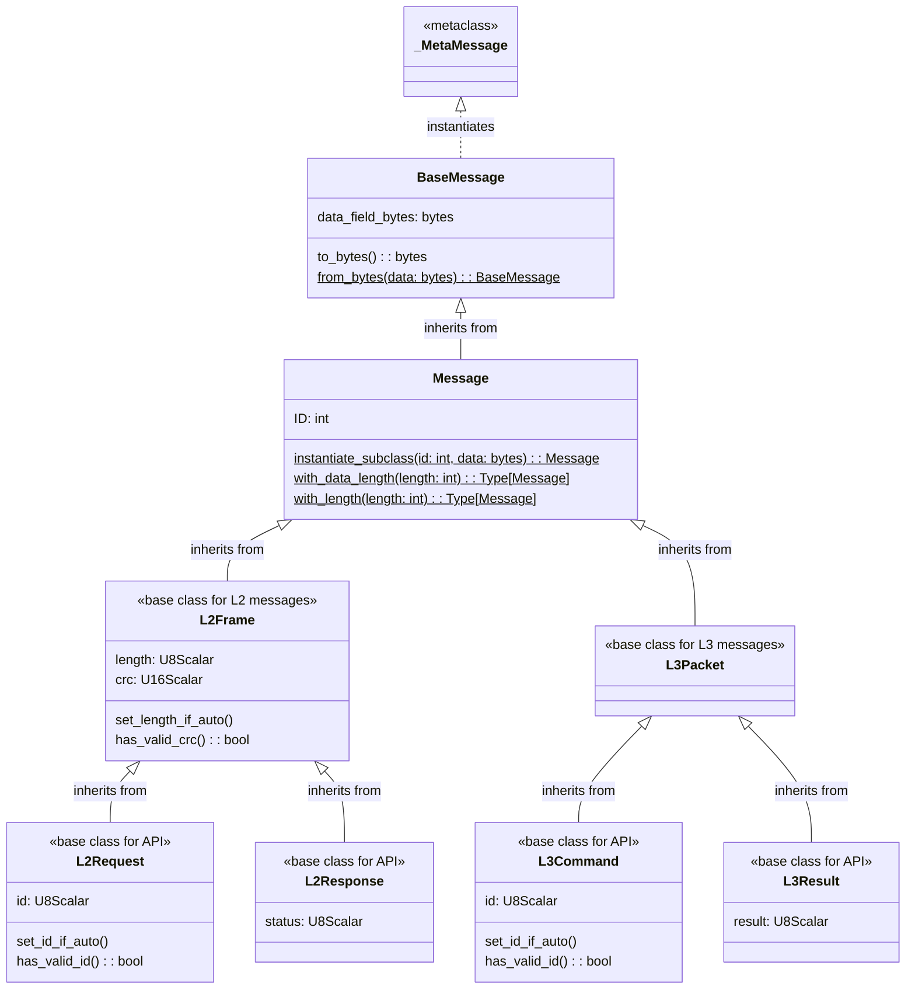
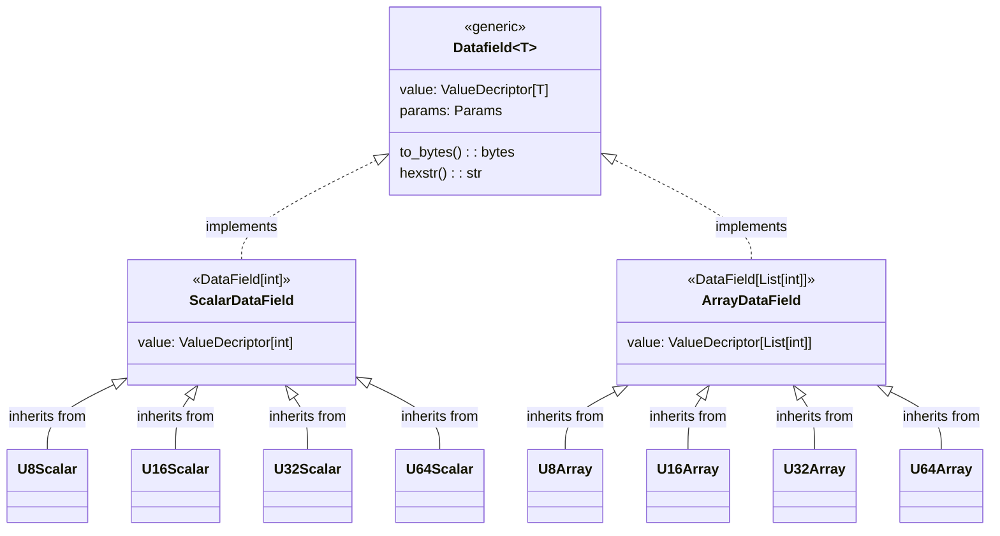

# Messages

The TVL adopts an OOP approach to handle L2-level and L3-level messages.
This approach aims to abstract the implementation details of the creation,
checking, serialization and deserialization of the messages.
It defines four main base classes, `L2Request`, `L2Response`, `L3Command` and
`L3Result`, from which all the message types defined in the API are derived.
Simply said, all the request, response, command and result types defined in the API
have been modelled as Python classes in the TVL.

These classes have been designed with the following features in mind:

- initialization of the field values with Python types: `int`, `List[int]` and `bytes`
- support for the following datatypes: `uint8_t`, `uint16_t`, `uint32_t` and `uint64_t`
- fields can be scalars (one value) or arrays (several values)
- padding of the value if necessary (in the case of arrays)
- support for enumerated values
- the value of some fields can be automatically computed:
    - L2-level messages: `REQ_ID`, `REQ_LEN`, `REQ_CRC`, `RSP_LEN`, `RSP_CRC`
    - L3-level messages: `CMD_ID`
- endianess can be either little or big
- serialization to `bytes` - the only type supported by the `TropicProtocol`
- deserialization from `bytes`
- deserialization even with variable length fields (only one per message is supported though).


## L2-level messages: requests and responses

Request and response types are modelled as Python classes: they inherit from
`L2Request` and `L2Response` respectively.
The classes are available in the file `l2_api.py`, which has been generated
from the API file.

### L2Request

The base class `L2Request` defines the basic structure of requests, it contains
the following fields:

- `id` (in the datasheet: `REQ_ID`)
- `length` (in the datasheet: `REQ_LEN`)
- `crc` (in the datasheet: `REQ_CRC`)

When inheriting from this base class, the fields defined by the child class are
considered as being the subfields of the `REQ_DATA` field.

### L2Response

The base class `L2Response` defines the basic structure of responses, it contains
the following fields:

- `status` (in the datasheet: `STATUS`)
- `length` (in the datasheet: `RSP_LEN`)
- `crc` (in the datasheet: `RSP_CRC`)

When inheriting from this base class, the fields defined by the child class are
considered as being the subfields of the `RSP_DATA` field.

### Automatic values

For practicality and user-friendliness reasons, the value of the fields `id`,
`length` and `crc` are set by default to the special value `AUTO`.
This involves that their value is going to be computed automatically when the
request object is serialized to `bytes`, thus allowing the user to focus on the
actual payload of the message.

Example:
```python
from tvl.api.l2_api import TsL2GetInfoRequest

original_request = TsL2GetInfoRequest(
    # Some values are enumerated
    object_id=TsL2GetInfoRequest.ObjectIdEnum.CHIP_ID,
    # int support
    block_index=0,
)
print(original_request.has_valid_crc())
# > True
print(original_request)
# > TsL2GetInfoRequest<(id=AUTO, length=AUTO, object_id=01, block_index=00, crc=AUTO)

# The id, length and crc field values are automatically computed.
request_bytes = original_request.to_bytes()
print(request_bytes)
# > b'\x01\x02\x01\x00+\x92'

rebuilt_request = TsL2GetInfoRequest.from_bytes(request_bytes)
print(rebuilt_request)
# > TsL2GetInfoRequest<(id=01, length=02, object_id=01, block_index=00, crc=922b)
print(original_request.has_valid_crc())
# > True
```

The user has of course the possibility not to leave the field value to `AUTO`
and set it to another value. Example with the `crc` field:

```python
from tvl.api.l2_api import TsL2GetInfoRequest

original_request_bad_crc = TsL2GetInfoRequest(
    # bytes support
    object_id=b"\x01",
    # List[int] support
    block_index=[0],
    # Forcing the crc value
    crc=0x1234
)
print(original_request_bad_crc.has_valid_crc())
# > False
print(original_request_bad_crc)
# > TsL2GetInfoRequest<(id=AUTO, length=AUTO, object_id=01, block_index=00, crc=1234)

# The id and length field values are automatically computed.
# The crc field value is that of the user.
request_bytes = original_request_bad_crc.to_bytes()
print(request_bytes)
# > b'\x01\x02\x01\x004\x12'

rebuilt_request = TsL2GetInfoRequest.from_bytes(request_bytes)
print(rebuilt_request)
# > TsL2GetInfoRequest<(id=01, length=02, object_id=01, block_index=00, crc=1234)
print(rebuilt_request.has_valid_crc())
# > False
```

## L3-level messages: commands and results

Command and result types are modelled as Python classes: they inherit from
`L3Command` and `L3Result` respectively.
The classes are available in the file `l3_api.py`, which has been generated
from the API file.

### L3Command

The base class `L3Command` defines the basic structure of plaintext commands,
it contains the following field:

- `id` (in the datasheet: `CMD_ID`)

When inheriting from this base class, the fields defined by the child class are
considered as being the subfields of the `CMD_DATA` field.

### L3Result

The base class `L3Result` defines the basic structure of plaintext responses,
it contains the following field:

- `result` (in the datasheet: `RESULT`)

When inheriting from this base class, the fields defined by the child class are
considered as being the subfields of the `RES_DATA` field.

### Automatic values

In the same spirit as for the L2-level messages , the value of the `id` field
of `L3Command` is set by default to the special value `AUTO`.
The user has of course the possibility to set the field to another value.
See [here](#automatic-values) for more details.

## Structure of message types

Messages are modelled from two types that are assembled together:

- `DataField` objects represent the fields a message is made of. They hold the value
of the field and the parameters needed for its serialization/deserialization.
- `Message` objects contain one or several `DataField` objects. They use the
parameters of the fields to serialize and deserialize the message.

### Example: study of an already-existing class

The class `TsL2EncryptedCmdRequest` is defined in the file `l2_api.py`.
Here is its definition:

```python
class TsL2EncryptedCmdRequest(L2Request, id=0x04): # (1)
    cmd_size: U16Scalar  # (2)
    cmd_ciphertext: U8Array[params(min_size=1, max_size=4096)]  # (3)
    cmd_tag: U8Array[params(size=16)]  # (4)
```

1.  - the class `TsL2EncryptedCmdRequest` inherits from `L2Request`, it has then
    the fields already defined by this latter, namely `id`, `length` and `crc`.
    - the `id` argument here defines the `ID` attribute of the new class.
    This attribute is important as it allows to deserialize the requests from `bytes`.
    Its value is set to `0x04`, which allows to create an `TsL2EncryptedCmdRequest`
    object with `L2Request.instantiate_subclass(0x04, <data>)`.
    **This argument is not to be confused here with the `id` field!**
2.  - `cmd_size` is the first subfield of the `REQ_DATA` field. It is a `U16Scalar`
    which means it is set with a single `int` in the constructor method of the message
    and accessing its `value` attribute will yield an `int`.
    This field will be serialized as an `uint16_t`.
3.  - `cmd_ciphertext` is the second subfield of the `REQ_DATA` field. it is a
    `U8Array`, which means it is set with a list of `int` in the constructor method
    of the message and accessing its `value` atribute will yield a list of `int`.
    The array has a variable size: it accepts a minimum of 1 element and a maximum of
    4096 elements. If this `DataField` value is not set, the array will be padded
    with as many zeroes as needed to reach the minimum required size, 1 element
    in this example. This field will be serialized as an array of `uint8_t`.
4.  - `cmd_tag` is the last subfield of the `REQ_DATA` field. It is a `U8Array`,
    meaning it is set with an `int` in the constructor method of the message
    and accessing its `value` attribute will yield an `int`. If this `DataField`
    value is not set or its array contains less than the fixed size, the array
    will be padded with as many zeroes as needed to reach the required size,
    16 elements in this example.
    This field will be serialized as an array of `uint8_t`.

```python
# Creating a request -> instantiate the class
request = TsL2EncryptedCmdRequest(
    # id=<other value>,                  # `id` field is accessible
    # length=<other value>,              # `length` field is also accessible
    cmd_size=4,                          # Initializing with int
    cmd_ciphertext=b"\x12\x34\x56\x78",  # Initializing with bytes
    cmd_tag=[1, 2, 3, 4],                # Initializing with List[int]
    crc=5678,                            # `crc` field is also accessible
)

print(request.id.value)  # Access to the value with the attributes
# > AUTO  # `id` field default value
print(request.ID)
# > 4
print(request.has_valid_id())
# > True
with request.set_id_if_auto():
    print(request.id.value)
    # > 4  # value attribute is an int.
    print(request.id.value == request.ID)
    # > True
print(request.id.value)
# > AUTO  # The value 'AUTO' is restored after the context manager has exited.

print(request.length.value)
# > AUTO  # `length` field default value
with request.set_length_if_auto():
    print(request.length.value)
    # > 22  # The REQ_DATA field is 22 byte long. This value is used when serializing.
print(request.length.value)
# > AUTO  # The value 'AUTO' is restored after the context manager has exited.

print(request.cmd_size.value)
# > 4  # value attribute is an int.
print(request.cmd_size.to_bytes())
# > b'\x04\x00'  # The value is processed as a `uint16_t`.

print(request.cmd_ciphertext.value)
# > [18, 52, 86, 120]  # value attribute is an list of int.
print(request.cmd_ciphertext.to_bytes())
# > b'\x124Vx'   # Array of `uint8_t`.

print(request.cmd_tag.value)
# > [1, 2, 3, 4, 0, 0, 0, 0, 0, 0, 0, 0, 0, 0, 0, 0]  # value attribute is an list of int.
# The list has been padded with zeroes so its length is 16.
print(request.cmd_tag.to_bytes())
# > b'\x01\x02\x03\x04\x00\x00\x00\x00\x00\x00\x00\x00\x00\x00\x00\x00'

print(request.crc.value)
# > 5678
print(request.has_valid_crc())
# > False
request.update_crc()  # Compute the correct crc and write it to the field.
print(request.has_valid_crc())
# > True
print(request.crc.value)
# > 62461

print(request)
# > TsL2EncryptedCmdRequest<(
#       id=AUTO,
#       length=AUTO,
#       cmd_size=0004,
#       cmd_ciphertext=[12, 34, 56, 78],
#       cmd_tag=[01, 02, 03, 04, 00, 00, 00, 00, 00, 00, 00, 00, 00, 00, 00, 00],
#       crc=f3fd
#   )
# `id` and `length` are set to `AUTO`, their value is going to be computed when `to_bytes` is called.
# Numbers are represented in hexadecimal.

# Serialize only the REQ_DATA field
print(request.data_field_bytes)
# > b'\x04\x00\x124Vx\x01\x02\x03\x04\x00\x00\x00\x00\x00\x00\x00\x00\x00\x00\x00\x00'
# split as such:
# b'\x04\x00'                                                          # cmd_size
# b'\x124Vx'                                                           # cmd_ciphertext
# b'\x01\x02\x03\x04\x00\x00\x00\x00\x00\x00\x00\x00\x00\x00\x00\x00'  # cmd_tag

# Serialize the whole request
data = request.to_bytes()
print(data)
# > b'\x04\x16\x04\x00\x124Vx\x01\x02\x03\x04\x00\x00\x00\x00\x00\x00\x00\x00\x00\x00\x00\x00\xfd\xf3'
# split as such:
# b'\x04'                                                              # id
# b'\x16'                                                              # length
# b'\x04\x00'                                                          # cmd_size
# b'\x124Vx'                                                           # cmd_ciphertext
# b'\x01\x02\x03\x04\x00\x00\x00\x00\x00\x00\x00\x00\x00\x00\x00\x00'  # cmd_tag
# b'\xfd\xf3'                                                          # crc

# First method of deserialization
rebuilt_request_1 = TsL2EncryptedCmdRequest.from_bytes(data)
print(rebuilt_request_1)
# > TsL2EncryptedCmdRequest<(
#       id=04,
#       length=16,
#       cmd_size=0004,
#       cmd_ciphertext=[12, 34, 56, 78],
#       cmd_tag=[01, 02, 03, 04, 00, 00, 00, 00, 00, 00, 00, 00, 00, 00, 00, 00],
#       crc=f3fd
#   )
print(rebuilt_request_1 == request)  # `to_bytes` is used for the comparison
# > True

# Second method of deserialization
rebuilt_request_2 = L2Request.instantiate_subclass(TsL2EncryptedCmdRequest.ID, data)
print(rebuilt_request_2)
# > TsL2EncryptedCmdRequest<(
#       id=04,
#       length=16,
#       cmd_size=0004,
#       cmd_ciphertext=[12, 34, 56, 78],
#       cmd_tag=[01, 02, 03, 04, 00, 00, 00, 00, 00, 00, 00, 00, 00, 00, 00, 00],
#       crc=f3fd
#   )
print(rebuilt_request_2 == request)
# > True

# Third method of deserialization
tmp = L2Request.with_length(len(data)).from_bytes(data)
print(tmp)
# > DefaultL2Request<(
#       id=04,
#       length=16,
#       default_data=[04, 00, 12, 34, 56, 78, 01, 02, 03, 04, 00, 00, 00, 00, 00, 00, 00, 00, 00, 00, 00, 00],
#       crc=f3fd
#   )
# The `DefaultL2Request` class is built on-the-fly, `default_data` is the only subfield in `REQ_DATA`.
rebuilt_request_3 = L2Request.instantiate_subclass(tmp.id.value, data)
print(rebuilt_request_3)
# > TsL2EncryptedCmdRequest<(
#       id=04,
#       length=16,
#       cmd_size=0004,
#       cmd_ciphertext=[12, 34, 56, 78],
#       cmd_tag=[01, 02, 03, 04, 00, 00, 00, 00, 00, 00, 00, 00, 00, 00, 00, 00],
#       crc=f3fd
#   )
print(rebuilt_request_3 == request)
# > True
```

## More details on message types

This is the inheritance tree of the `Message` class:



And this is the inheritance tree of the `Datafield` class:


