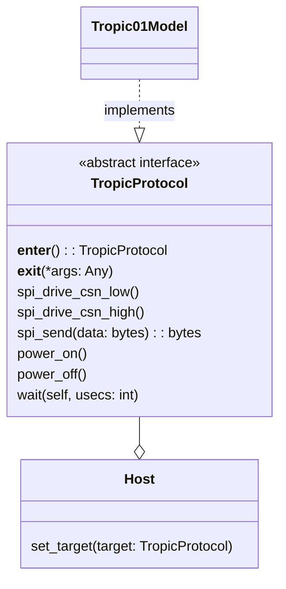

# Targets

More information on the `Tropic01Model` [here](./model/README.md).

## TropicProtocol

The `TropicProtocol` is at the center of the TVL. This protocol defines a set of
methods a target has to implement to be considered as a target.

The diagram below expresses the relationships between the `TropicProtocol` and
the other components of the TVL:



> The `TropicProtocol` is implemented as a
> [typing.Protocol](https://docs.python.org/3.8/library/typing.html#typing.Protocol)
> and not an [abc.ABC](https://docs.python.org/3.8/library/abc.html#abc.ABC).
> The compliance of a target to the `TropicProtocol` is thus not enforced at
> runtime but is rather checked by static type checkers during the development.

It is even more important for a target to comply with the `TropicProtocol` that
it will allow it to be used by the `Host`. More on the `Host` [here](../host/README.md).

## Communication with a target

The communication protocol of a TROPIC01 target is defined in the
[datasheet](https://tropic-gitlab.corp.sldev.cz/internal/tropic01/tassic/-/jobs/artifacts/master/file/public/tropic01_datasheet.pdf?job=pages).

It consists of three layers:
- physical layer (L1)
- data link layer (L2)
- secure session layer (L3)

### L1-level communication

The physical layer (or L1 layer) of the TROPIC01 chip is a SPI slave interface.
The `TropicProtocol` provides three method to control this SPI interface:

```python
class TropicProtocol(Protocol):

    def spi_drive_csn_low(self) -> None:
        """Drive the Chip Select signal to LOW."""
        ...

    def spi_drive_csn_high(self) -> None:
        """Drive the Chip Select signal to HIGH."""
        ...

    def spi_send(self, data: bytes) -> bytes:
        """Send data to the chip and receive as many bytes as response."""
        ...
```

Communicating with a target boils down to using these three methods:

```python
target = <TropicProtocol-compliant target>

# Start transaction
target.spi_drive_csn_low()
# Send and receive data
received_data = target.spi_send(sent_data)
# End transaction
target.spi_drive_csn_high()
```

### L2-level communication

The data link layer (or L2 layer) of the TROPIC01 chip is modelled by messages
called request (sent to the chip) and response (received from the chip).

To abstracts the L2-level communication with a target, the file
`low_level_communication.py` provides the following function:

```python
def ll_send_l2_request(
    data: bytes,             # the request
    target: TropicProtocol,  # the target to send the request to
    logger: logging.Logger,  # logs the activity
) -> bytes:                  # the response
```

To abstracts implementation details for the user, the TVL adopts an OOP approach
for creating requests and responses.
More on this topic [here](../messages/README.md).

The `Host` also provides a method for sending requests and receiving responses
to and from a target: `send_request`. This method accepts the request as being
`bytes` or a request object.
Furthermore, he `Host` models the secure session on the Host MCU side, therefore
keeping encryption keys and all the elements required to establish a secure channel
with a target.
More on the `Host` [here](../host/README.md).

### L3-level communication

The secure channel session layer (or L3 layer) of the TROPIC01 chip is handled
by messages called command (sent to the chip) and result (received from the chip).
The L3-level communication with the chip is enabled once the secure channel has
been established - typically by sending a `Handshake_Req` request to the chip.

To abstracts the L3-level communication with a target, the file
`low_level_communication.py` provides the following function:

```python
def ll_send_l3_command(
    cmd_chunks: List[bytes],  # the command has to be chunked beforehand
    target: TropicProtocol,   # the target to send the command to
    logger: logging.Logger,   # logs the activity
) -> List[bytes]:             # the result is received chunked
```

To abstracts implementation details for the user, the TVL adopts an OOP approach
for creating commands and results.
More on this topic [here](../messages/README.md).

A command has to be encrypted and possibly chunked into requests before it can
be sent to the chip. Similarly, the result received from the chip has to be
rebuilt if chunked and then decrypted.

The `Host` abstracts the implementation details of such tasks for the user and
and provides a method for handling commands and results: `send_command`.
This method accepts the command as being `bytes` or a request object.
More on the `Host` [here](../host/README.md).


## Examples of communication

### Sending of a request: L2-level communication

#### Without `Host`

```python
import logging

from tvl.host.host.low_level_communication import ll_send_l2_request

logger = logging.getLogger("example")
target = <TropicProtocol-compliant target>

request = b"l2_level_message"
response = ll_send_l2_request(request, target, logger)
```

> The user can of course replace `ll_send_l2_request` by any other function.
> The example merely shows the function implemented in the TVL.

#### With `Host`

```python
from tvl.host.host import Host

target = <TropicProtocol-compliant target>
host = Host(target=target)

request = b"l2_level_message"
response = host.send_request(request)
```

### Sending of a command: L3-level communication

#### Without `Host`

```python
import logging
from typing import List

from tvl.host.host.low_level_communication import ll_send_l3_command

def encrypt_command(command: bytes) -> bytes:
    """User implementation"""
    ...

def chunk_command(command: bytes) -> List[bytes]:
    """User implementation"""
    ...

def build_result(chunks: List[bytes]) -> bytes:
    """User implementation"""
    ...

def decrypt_result(result: bytes) -> bytes:
    """User implementation"""
    ...

logger = logging.getLogger("example")
target = <TropicProtocol-compliant target>

command = b"l3_level_message"
encrypted_command = encrypt_command(command)
command_chunks = chunk_command(encrypted_command)

# We assume that the secure channel is already established
# i.e. the L3-level communication is enabled.
result_chunks = ll_send_l3_command(command_chunks, target, logger)
encrypted_result = build_result(result_chunks)
result = decrypt_result(encrypted_result)
```

> The user can of course replace `ll_send_l3_request` by any other function.
> The example merely shows the function implemented in the TVL.

#### With `Host`

```python
from tvl.host.host import Host

target = <TropicProtocol-compliant target>
host = Host(target=target)

command = b"l3_level_message"
# We assume that the secure channel is already established
# i.e. the L3-level communication is enabled.
# The `Host` encrypts and chunks the command, rebuilds and decrypts the result
result = host.send_command(command)
```
