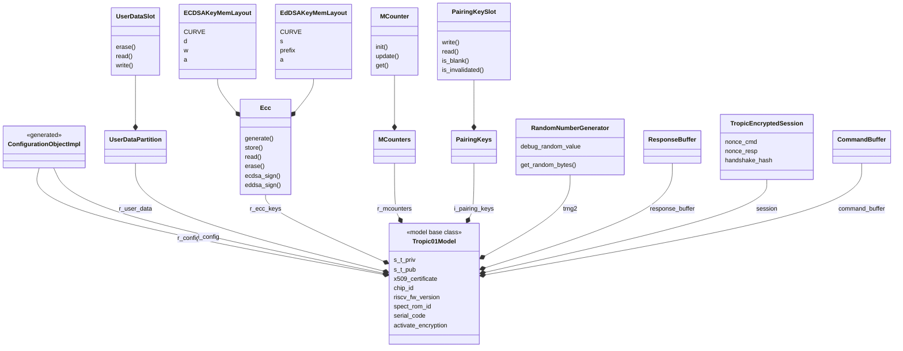

# Tropic01Model
The `Tropic01Model` class is a functional model of the TROPIC01 chip written in [Python](https://www.python.org/).
Use `Tropic01Model` as the behavioral reference for testing different TROPIC01 implementations.

## Communication protocol

The `Tropic01Model` communication protocol is defined in the TROPIC01 datasheet.

More on the topic [here](../README.md#communication-with-a-target).

## Composition

The model is composed of functional blocks of TROPIC01 that have been replicated
in Python. The following diagram shows how the `Tropic01Model` class is composed.

> Some classes on this diagram cannot be instantiated and passed to the constructor
> method of the `Tropic01Model` as they are only internal.



## Instantiation

The preferred way to instantiate the `Tropic01Model` class is to use its
`from_dict` class method and provide it nested dictionaries containing simple values.

Examples:
```python
from tvl.targets.model.tropic01_model import Tropic01Model

model = Tropic01Model.from_dict(
    {
        "s_t_priv": b"TROPIC_PRIVATE_KEY",
        "s_t_pub": b"TROPIC_PUBLIC_KEY",
        "x509_certificate": b"X509_CERTIFICATE",
        "serial_code": b"12345678",
        "i_pairing_keys": {
            1: {"value": b"HOST_1_PUBLIC_KEY"},
            2: {"value": b"HOST_2_PUBLIC_KEY"},
        },
        "r_ecc_keys": {
            1: {
                "a": b"ECDSA_PUBLIC_KEY_SLOT_1",
                "d": b"ECDSA_PRIVATE_KEY_1_SLOT_1",
                "origin": 1,
                "w": b"ECDSA_PRIVATE_KEY_2_SLOT_1",
            },
            5: {
                "a": b"ECDSA_PUBLIC_KEY_SLOT_5",
                "d": b"ECDSA_PRIVATE_KEY_1_SLOT_5",
                "origin": 2,
                "w": b"ECDSA_PRIVATE_KEY_2_SLOT_5",
            },
        },
    }
)
```

The method `Tropic01Model.from_dict` parses the dictionary and propagates its
content to the internal components of the model, calling their respective
`from_dict` method. The configuration then "trickles" down from one `from_dict`
class method to another located one level deeper inside the hierarchy.

This method has the advantage that it manipulates simple dictionaries, that can
be parsed from a yaml file for example
(see [below](#creating-a-configuration-for-both-tropic01model-and-host)).

### Validating the configuration

The [`configuration_file_model.py`](../../configuration_file_model.py)
file provides a [pydantic](https://pypi.org/project/pydantic/1.10.13/)
model for validating the model configuration dictionary: `ModelConfigurationModel`.

Example:
```python
from tvl.targets.model.tropic01_model import Tropic01Model
from tvl.configuration_file_model import ModelConfigurationModel

model_configuration = {
        "s_t_priv": b"TROPIC_PRIVATE_KEY",
        "s_t_pub": b"TROPIC_PUBLIC_KEY",
        "x509_certificate": b"X509_CERTIFICATE",
        "serial_code": b"12345678",
        "i_pairing_keys": {
            1: {"value": b"HOST_1_PUBLIC_KEY"},
            2: {"value": b"HOST_2_PUBLIC_KEY"},
        },
        "r_ecc_keys": {
            1: {
                "a": b"ECDSA_PUBLIC_KEY_SLOT_1",
                "d": b"ECDSA_PRIVATE_KEY_1_SLOT_1",
                "origin": 1,
                "w": b"ECDSA_PRIVATE_KEY_2_SLOT_1",
            },
            5: {
                "a": b"ECDSA_PUBLIC_KEY_SLOT_5",
                "d": b"ECDSA_PRIVATE_KEY_1_SLOT_5",
                "origin": 2,
                "w": b"ECDSA_PRIVATE_KEY_2_SLOT_5",
            },
        },
    }
# Check the configuration with the dedicated pydantic model
ModelConfigurationModel.validate(model_configuration)
# An error is raised if the configuration is invalid
model = Tropic01Model.from_dict(model_configuration)
```

> The `Host` class can also be instantiated this way and also has a dedicated
> pydantic model to validate its configuration, `HostConfigurationModel`.
> More info [here](../README_HOST.md).

## Instantiating and configuring `Tropic01Model` and `Host` from a yaml file

The `configuration_file_model.py` file provides
the function `load_configuration_file` for loading the configuration of the
model and the host from a [yaml](https://yaml.org/) file and validating it.

Example:
```python
from tvl.configuration_file_model import load_configuration_file
from tvl.host.host import Host
from tvl.targets.model.tropic01_model import Tropic01Model

configuration = load_configuration_file("config.yaml")

# The model configuration is under the keyword "model"
model = Tropic01Model.from_dict(configuration["model"])
# The host configuration is under the keyword "host"
host = Host.from_dict(configuration["host"]).set_target(model)
```

### Creating a configuration for both `Tropic01Model` and `Host`

The `configuration_file_model.py` file also contains a pydantic model for
validating both configurations of the model and the host at the same time:
`ConfigurationFileModel`.

Example:
```python
import yaml
from tvl.configuration_file_model import ConfigurationFileModel

configuration = {
    "host": {
        "s_h_priv": b"HOST_PRIVATE_KEY",
        "s_h_pub": b"HOST_PUBLIC_KEY",
        "s_t_pub": b"TROPIC_PUBLIC_KEY",
        "pairing_key_index": 4,
    },
    "model": {
        "s_t_priv": b"TROPIC_PRIVATE_KEY",
        "s_t_pub": b"TROPIC_PUBLIC_KEY",
        "i_pairing_keys": {
            4: {
                "value": b"HOST_PUBLIC_KEY",
            },
        },
        "r_user_data": {
            5: {
                "value": b"USER_DATA_SLOT_5",
            },
        },
        "r_ecc_keys": {
            27: {
                "a": b"ECDSA_PUBLIC_KEY_SLOT_27",
                "d": b"ECDSA_PRIVATE_KEY_1_SLOT_27",
                "origin": 1,
                "w": b"ECDSA_PRIVATE_KEY_2_SLOT_27",
            },
        },
        "r_mcounters": {
            4: {
                "value": 0xABCDEF
            }
        },
        "i_config": {
            "cfg_uap_ping": 0xDB,
        },
        "riscv_fw_version": b"0.9.2",
    },
}
# Check the configuration with the dedicated pydantic model
ConfigurationFileModel.validate(model_configuration)
# An error is raised if the configuration is invalid

# The configuration can easily be written to a file for persistent storage
with open("config.yaml", "w") as fd:
    yaml.dump(configuration, fd)
```

A concrete example of how to create a valid configuration file is in the file
[`examples/generate_configuration.py`](../../../examples/generate_configuration.py).
